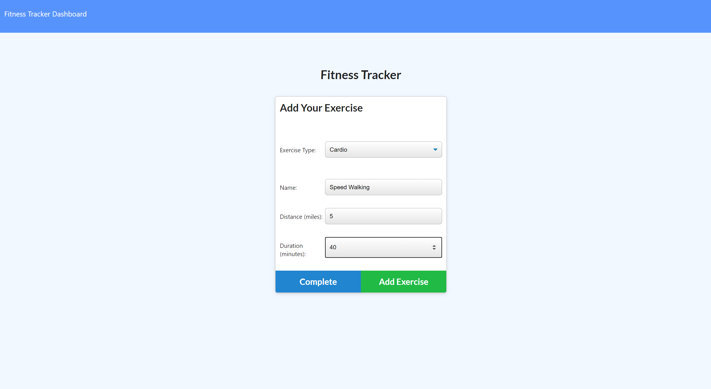

# WorkoutTracker
<h3>A full stack workout tracker application utilizing MongoDB, Mongoose, and Express.</h3>

---

## User Story

* As a user, I want to be able to view create and track daily workouts. I want to be able to log multiple exercises in a workout on a given day. I should also be able to track the name, type, weight, sets, reps, and duration of exercise. If the exercise is a cardio exercise, I should be able to track my distance traveled.

## Business Context

A consumer will reach their fitness goals more quickly when they track their workout progress.

## Functionality

<h2>User is able to:</h2>

* Add exercises to the most recent workout plan
* Add new exercises to a new workout plan
* View the combined weight of multiple exercises from the past seven workouts on the `stats` page
* View the total duration of each workout from the past seven workouts on the `stats` page

---

  

---

  

---

  

---

# Credits/Contact

Helen I. Lindberg 
Email: helenilindberg@yahoo.com 
Github Profile: <a href="https://github.com/HelenIL">https://github.com/HelenIL</a> 
  
Heroku deployed page: <a ref="https://workout-fitness-tracking-app.herokuapp.com/">
